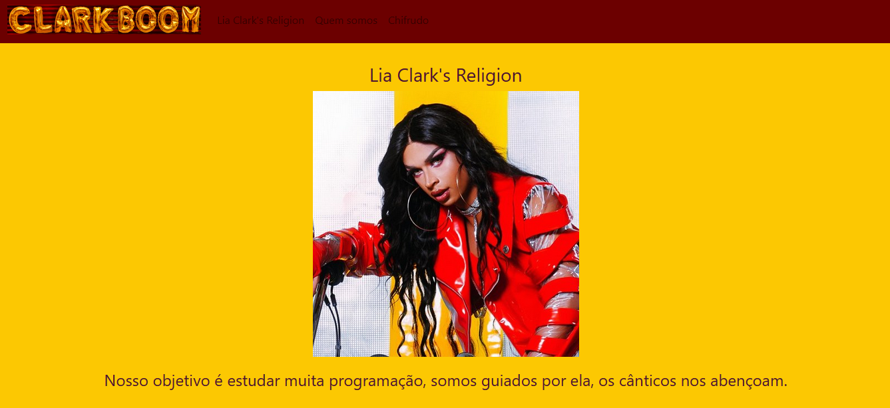

# dio-bootstrap-aula1
Site feito com estudos da aula de Bootstrap da DIO.

Para testar a versão ao vivo, [clique aqui.](https://cursos-e-estudos.github.io/dio-bootstrap-aula1/)
 

<b> Visual desktop </b>

  

 

---